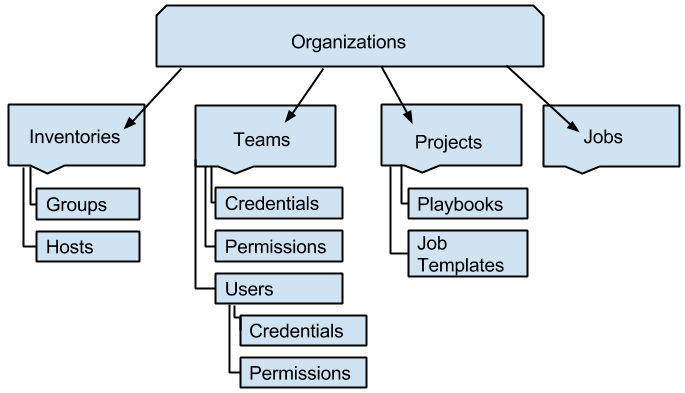
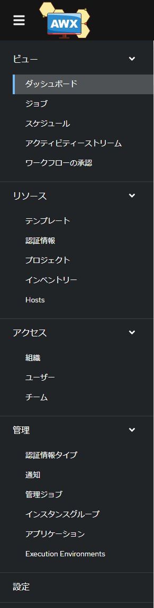
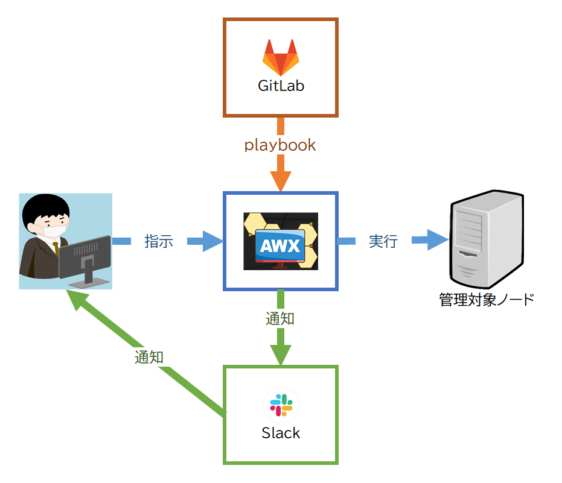

.. _awx-about:

##################################################
AWX
##################################################

.. _awx-about-toha:

**************************************************
AWX とは
**************************************************
- Ansible の機能を補うためのツール
- 具体的には Web ベースの GUI 、ジョブ管理（スケジュール実行を含む）、ワークフロー、他システムと連携などの機能を提供する
- AWX の商用版が Ansible Tower

.. _awx-about-image:

**************************************************
AWX の全体イメージ
**************************************************
AWX の全体イメージです。

.. admonition:: 出典

   | `「 Japanese: Ansible Tower ユーザーガイド v3.8.1 」の「 7. 組織」 <https://docs.ansible.com/ansible-tower/3.8.1/html_ja/userguide/organizations.html>`_
   | `(https://docs.ansible.com/ansible-tower/3.8.1/html_ja/userguide/organizations.html) <https://docs.ansible.com/ansible-tower/3.8.1/html_ja/userguide/organizations.html>`_

組織 : Organizations
   - AWX でジョブを管理 / 実行するためのすべての構成要素（オブジェクト）を管理するためのグループ
   - AWX の階層で最上位のオブジェクト

インベントリ : Inventory
   - 管理対象ノードに関する情報を管理する

チーム : Teams
   - ユーザーを用途ごとにまとめたグループ　例：設計チーム、構築チーム、運用チーム　等
   - チームごとに権限の付与が可能
   - ユーザー : Users
      - チームに含まれるメンバー
      - ユーザーごとに権限の付与が可能
      - AWX にログインするときのアカウントを兼ねる
      - LDAP や Active Directory との連携が可能
   - 認証情報 : Credentials
      - 管理対象ノードに ssh 接続するときの認証情報を管理する
      - 他システム（例 : GitLab ）や他サービスに接続するときの認証情報を管理する

プロジェクト : Projects
   - プレイブックを管理する
   - 認証情報を使用してプレイブックファイルを保持する他システムと連携する情報を管理する
   - テンプレート : Job Templates
      - ジョブを実行するのに必要な情報（インベントリ、プレイブック / プロジェクト、認証情報 等）を管理する

ジョブ : Jobs
   - テンプレートやワークフローの実行結果とログを管理する
   - 実行結果はジョブとして再実行可能

.. _awx-about-menu:

**************************************************
AWX のメニュー
**************************************************
AWX のメニュー部分の画像です。「 :ref:`awx-about-image` 」で説明した各機能が含まれます。

.. _awx-about-allimage:

**************************************************
AWX を含めた全体イメージ
**************************************************

