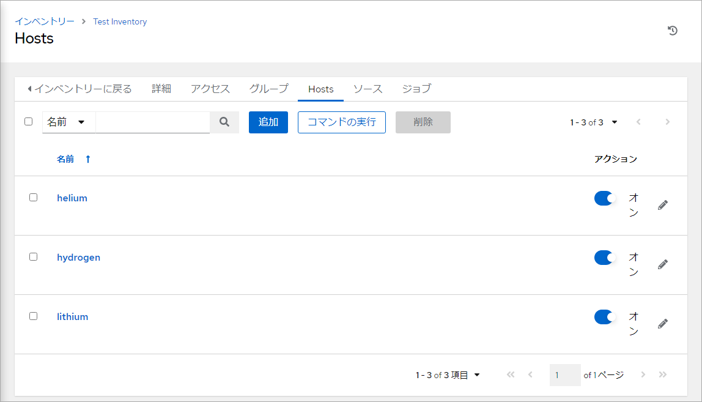

.. _awx-inventory-host:

##################################################
インベントリに管理対象ノードを追加
##################################################
インベントリに管理対象ノードを追加します。

#. :guilabel:`インベントリー` をクリック

   .. image:: img/2021-07-04_06h40_17.png
      :scale: 60%

#. 管理対象ノードを追加するインベントリをクリック

   .. image:: img/2021-07-04_06h40_34.png
      :scale: 60%

#. :guilabel:`Hosts` をクリック

   .. image:: img/2021-07-04_06h40_48.png
      :scale: 60%

#. :guilabel:`追加` をクリック

   .. image:: img/2021-07-04_06h41_02.png
      :scale: 60%

#. 各項目に値を入力

   .. list-table::
      :header-rows: 1
      :widths: 1, 10

      * - 項目名
        - 入力する値
      * - 名前
        - 管理対象ノード名
      * - 説明
        - 管理対象ノードの説明
      * - 変数
        - 管理対象ノードに適用する変数（ホスト変数）

   .. image:: img/2021-07-04_06h45_35.png
      :scale: 60%

#. :guilabel:`保存` をクリック

   .. image:: img/2021-07-04_06h45_55.png
      :scale: 60%

#. :guilabel:`ホストに戻る` をクリック

   .. image:: img/2021-07-04_06h46_12.png
      :scale: 60%

#. 追加した管理対象ノードを確認　→　追加終了

   .. image:: img/2021-07-04_06h46_24.png
      :scale: 60%

|

同様の手順で残りの管理対象ノードを追加した状態です。

